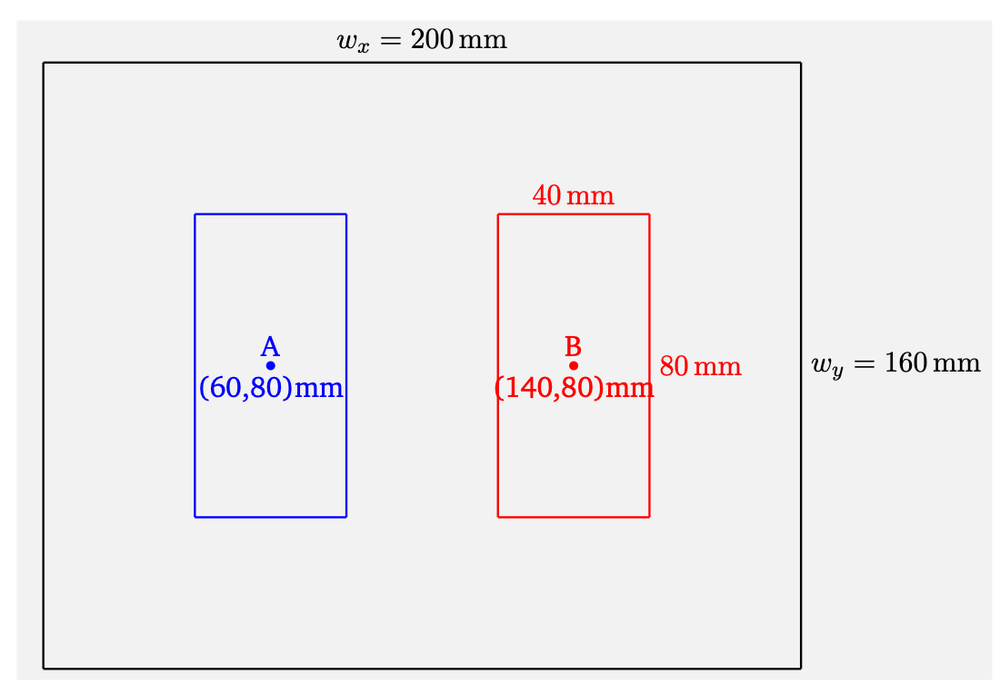

# Nondestructive Testing by Electromagnetic Waves and Time-Reversal Techniques

This project is part of the "Science in Practice I" course and aims to detect objects in a cube using Time Reversal Techniques inspired by the principles described in the paper "Time-reversal acoustics" by Mathias Fink [[1]](https://iopscience.iop.org/article/10.1088/1742-6596/118/1/012001/pdf). Time-Reversal Acoustics is a method based on the principles of wave propagation reciprocity, which has wide-ranging applications in the field of acoustics, including medical imaging, underwater communication, and non-destructive testing.

  

## Overview

This repository contains the implementation of Time-Reversal Acoustics (TRA) techniques for detecting objects within a resonant box. The project is divided into multiple modules, each focusing on specific aspects of electromagnetic wave simulations and TRA-based object detection.

## Modules

### Module 1: Eigenvalue FIT Solver

In this module, we provide analytical and numerical solutions to the eigenvalue problem within a box resonator. Additionally, we conduct a convergence study to assess the accuracy and efficiency of the solver.

#### Problem Setting
Consider a box with dimensions $w_x = 200$ mm, $w_y = 160$ mm, and $w_z = 120$ mm, filled with air with walls with a very high conductivity. In this module, the first 15 electromagnetic eigenmodes will be determined using an eigenmode solver.

#### Results

Some plotted modes and modes of the numerical and analytical solution:

  
  

### Module 2: Frequency Domain FIT Solver

Module 2 extends the capabilities of the FIT solver to the frequency domain, considering spatial distributions. A convergence study is also included to evaluate the solver's performance.

#### Problem Setting
Same box as in module 1 ($w_x = 200$ mm, $w_y = 160$ mm, and $w_z = 120$ mm, filled with air with walls with a very high conductivity), but now we determined the first 15 electromagnetic eigenmodes using an frequency domain solver.

#### Results

Relative error of convergence study:

  

### Module 3: Time Domain FIT Solver with Chirp

This module introduces a time domain FIT solver with electrical stimulation using chirp signals.

#### Problem Setting:
Define a chirp with a frequency increasing from $f_0 = 1$ GHz to $f_1 = 5$ GHz between $t_0 = 0$ s and $t_1 = 20$ ns. Modulate this signal by a Gaussian function with a center point at $t_g = 10$ ns, variance $\sigma^2 = (5ns)^2$, and amplitude $\hat{i} = 1$ A, resulting in a current signal $i(t)$. Plot the current signal and its spectrum between $t_0$ and $t_2 = 5t_1$.

#### Results

Signal in Frequency Domain:

  

Signal in Time Domain:

  

### Module 4: Time Reversal Techniques

Module 4 explores Time Reversal Techniques to restore and focus signals, a fundamental concept in Time-Reversal Acoustics.

#### Problem Setting
Consider a magnetic boundary condition at the bottom of the box. Keep electric boundary conditions at all other boundaries. Model two electrodes A and B at the bottom plan. Their centre points are 60 mm away from the left and right boundary and exactly in the centre between the front and back plane. The electrodes have an extend of 40 mm in the x-direction and 80 mm in the y-direction. Explore Time Reversal Techniques to restore and focus signals at electrode A.

  

#### Results

Measurements of the forward and reversed signal at electrode A:

  

### Module 5: Cube Detection Inside a Box Resonator

In this final module, we apply Time-Reversal Techniques to detect the presence and position of cubes within the box resonator. The objective is to locate cubes using TRA-based methods. 

#### Problem Setting
Consider a magnetic boundary condition at the bottom of the box. Keep electric boundary conditions at all other boundaries. Model two electrodes A and B at the bottom plan. Their centre points are 60 mm away from the left and right boundary and exactly in the centre between the front and back plane. The electrodes have an extend of 40 mm in the x-direction and 80 mm in the y-direction. Now additionally fully inside the resonator is a perfect-electric-conducting (PEC) cube with size 20 mm at a varying position. The goal is now to detect the cube through measurements at the electrodes A and B.

#### Results

Measurements of the forward and reversed signal at electrode A:

  

This README provides an overview of the repository's contents and highlights the problem settings and methodologies employed in each module. Feel free to explore the repository further for detailed implementations and simulations of time-reversal technqiues.
